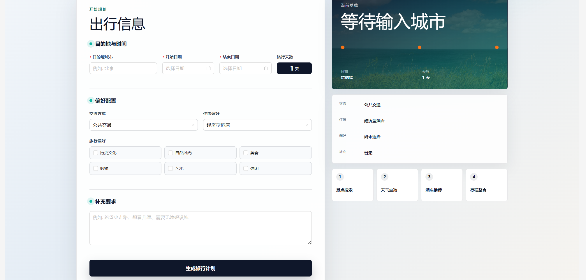
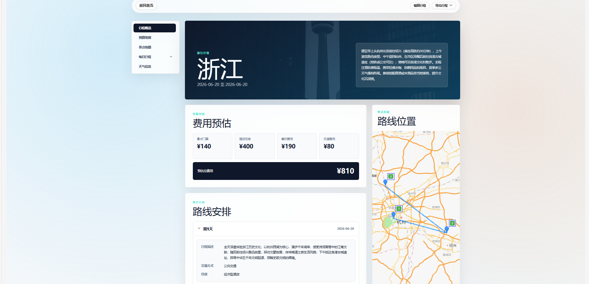
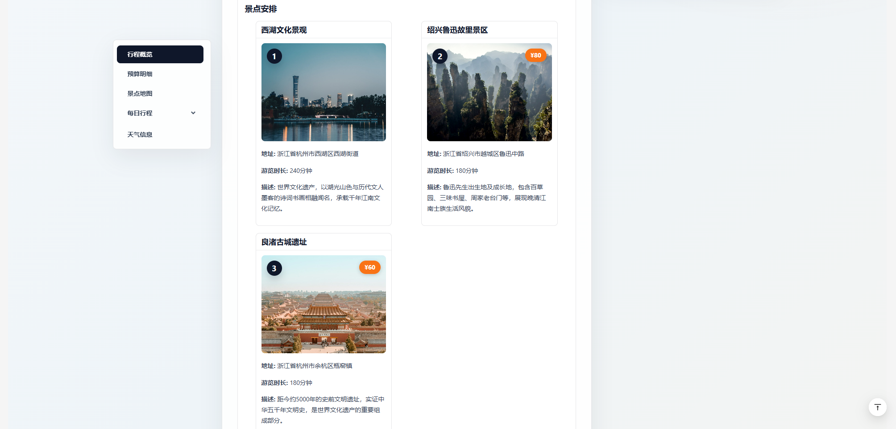
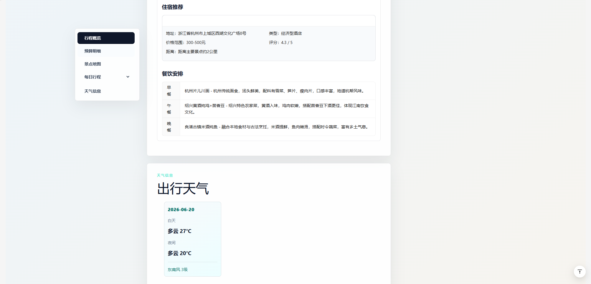
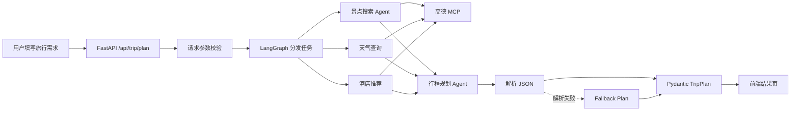

<div align="center">

# 智能旅行助手

### 基于多 Agent 协作的个性化旅行规划系统

输入目的地、日期与旅行偏好，自动生成包含景点、酒店、餐饮、天气、预算和地图路线的一站式旅行计划。

[](https://vuejs.org/)
[](https://fastapi.tiangolo.com/)
[](https://www.python.org/)
[](https://www.langchain.com/langgraph)

**[在线体验](http://47.96.239.234:82)** · **[核心流程](#核心流程)** · **[本地运行](#本地运行)**

</div>

---

## 项目简介

传统旅行规划需要在景点、天气、酒店、地图和预算等多个平台之间来回查询。本项目将这些步骤组合成一个完整的智能规划流程：

用户只需填写目的地、出行日期、交通方式、住宿偏好和兴趣标签，系统便会协调多个 Agent 分别收集信息，再由规划 Agent 汇总生成结构化行程。最终结果不仅是一段文字，还包含可交互地图、每日路线、景点图片、酒店与餐饮建议、天气信息及费用预估。

> 当前项目已部署到云服务器，可通过 [http://47.96.239.234:82](http://47.96.239.234:82) 在线访问。

## 页面展示

### 旅行信息收集

首页将表单与旅行草稿放在同一页面。用户填写信息时，右侧会实时展示当前选择，并明确呈现景点搜索、天气查询、酒店推荐和行程整合四个处理阶段。



### 行程总览

结果页集中展示目的地概览、费用预算、每日路线和高德地图位置，并支持编辑行程以及导出图片或 PDF。



### 景点、住宿与出行信息

<table>
  <tr>
    <td width="50%">
      
    </td>
    <td width="50%">
      
    </td>
  </tr>
  <tr>
    <td align="center">景点推荐、图片、地址、游览时长与票价</td>
    <td align="center">酒店、餐饮安排与出行天气</td>
  </tr>
</table>

## 项目亮点

### 多 Agent 分工协作

系统不是让一个 Agent 完成所有任务，而是拆分为不同角色：

- **景点搜索 Agent**：根据城市和兴趣偏好寻找候选景点。
- **天气查询节点**：获取目的地的实时天气信息。
- **酒店推荐节点**：结合住宿偏好搜索酒店。
- **行程规划 Agent**：汇总景点、天气和酒店信息，生成完整计划。

每个 Agent 只关注自己的职责，使提示词更明确，也方便单独定位问题和扩展能力。

### LangGraph 工作流编排

后端使用 LangGraph 管理规划流程。输入校验完成后，景点、天气和酒店任务从同一节点分发执行，再将结果统一交给规划 Agent，避免业务流程散落在大量条件判断中。

### MCP 连接真实地图能力

Agent 通过 MCPTool 调用高德 MCP 服务，获得 POI 搜索、天气查询、地点详情与路线规划等真实数据，使生成结果不只依赖模型自身知识。

### 结构化数据与容错机制

- 使用 Pydantic 定义 `TripRequest`、`TripPlan`、`DayPlan`、`Attraction` 等模型。
- 将 Agent 返回的 JSON 文本解析为明确的 `TripPlan` 对象。
- Agent 调用或 JSON 解析失败时，通过 fallback plan 返回基础行程，避免接口直接无数据。
- FastAPI 自动完成请求校验和响应模型约束。

### 完整的可视化结果

前端不仅展示文本，还整合了：

- 高德地图路线与景点坐标
- Unsplash 景点图片
- 每日景点、酒店和餐饮安排
- 天气、交通及预算分类统计
- 行程编辑、图片导出和 PDF 导出

### 前后端分离并完成线上部署

前端使用 Vue 3 + TypeScript 构建，后端使用 FastAPI 提供 REST API，并通过 Docker Compose 部署到云服务器。前端由 Nginx 托管，前后端使用独立端口运行。

## 核心流程



## 技术架构

| 层级 | 技术 | 主要职责 |
| --- | --- | --- |
| 前端 | Vue 3、TypeScript、Vite、Ant Design Vue | 表单收集、行程展示、地图渲染与导出 |
| 后端 | FastAPI、Pydantic、Uvicorn | API、参数校验、响应模型与 CORS |
| Agent | HelloAgents、LangGraph | 多 Agent 调用与工作流编排 |
| 工具 | 高德 MCP、Unsplash API | POI、天气、路线与景点图片 |
| 部署 | Docker Compose、Nginx | 前后端容器化和静态资源托管 |

## 项目结构

```text
trip-planner/
├─ frontend/
│  └─ src/
│     ├─ services/          # API 请求封装
│     ├─ types/             # TypeScript 数据类型
│     └─ views/             # 首页与结果页
├─ backend-learn/
│  └─ app/
│     ├─ agents/            # Agent 与 LangGraph 工作流
│     ├─ api/routes/        # trip、poi、map 路由
│     ├─ models/            # Pydantic 数据模型
│     └─ services/          # 高德、LLM、Unsplash 服务
├─ docs/images/             # README 展示图片
└─ README.md
```

## 核心接口

| 方法 | 接口 | 说明 |
| --- | --- | --- |
| `POST` | `/api/trip/plan` | 根据用户需求生成完整旅行计划 |
| `GET` | `/api/poi/photo` | 根据景点名称查询图片 |
| `GET` | `/api/poi/search` | 搜索高德 POI |
| `GET` | `/api/poi/detail/{poi_id}` | 查询 POI 详情 |
| `GET` | `/api/map/weather` | 查询城市天气 |
| `POST` | `/api/map/route` | 规划地点之间的路线 |
| `GET` | `/health` | 后端健康检查 |

## 本地运行

### 1. 克隆项目

```bash
git clone https://github.com/zoupingan/trip-planner.git
cd trip-planner
```

### 2. 启动后端

```powershell
cd backend-learn
python -m venv .venv
.\.venv\Scripts\Activate.ps1
pip install -r requirements.txt
Copy-Item .env.example .env
python run.py
```

后端默认运行在 `http://127.0.0.1:8001`，API 文档地址为 `http://127.0.0.1:8001/docs`。

### 3. 启动前端

```powershell
cd frontend
npm install
Copy-Item .env.example .env
npm run dev
```

前端默认运行在 `http://localhost:5173`。

## 环境变量

真实密钥不能提交到 GitHub。请分别复制项目中的 `.env.example`，再填写自己的配置。

### 后端 `backend-learn/.env`

| 变量 | 是否必需 | 用途 |
| --- | --- | --- |
| `LLM_API_KEY` | 是 | 大语言模型 API Key |
| `LLM_BASE_URL` | 是 | OpenAI 兼容接口地址 |
| `LLM_MODEL_ID` | 是 | 模型名称 |
| `AMAP_API_KEY` | 是 | 后端高德 MCP 服务 |
| `UNSPLASH_ACCESS_KEY` | 是 | 景点图片搜索 |
| `UNSPLASH_SECRET_KEY` | 否 | Unsplash 扩展配置 |
| `CORS_ORIGINS` | 是 | 允许访问后端的前端地址 |

### 前端 `frontend/.env`

| 变量 | 是否必需 | 用途 |
| --- | --- | --- |
| `VITE_API_BASE_URL` | 是 | FastAPI 后端地址 |
| `VITE_AMAP_WEB_JS_KEY` | 是 | 高德地图 JavaScript API Key |

> `VITE_` 开头的变量会打包到浏览器代码中，不能存放后端密钥。

## 安全说明

- `.env`、虚拟环境、依赖目录和构建产物均已加入 `.gitignore`。
- 仓库只提交不包含真实密钥的 `.env.example`。
- 不要在源码中写入服务器密码、API Key 或 Access Token。
- 如果密钥曾被提交到公开仓库，应立即在对应平台重置，而不只是删除文件。

---

<div align="center">

如果这个项目对你有帮助，欢迎点一个 Star。

</div>
